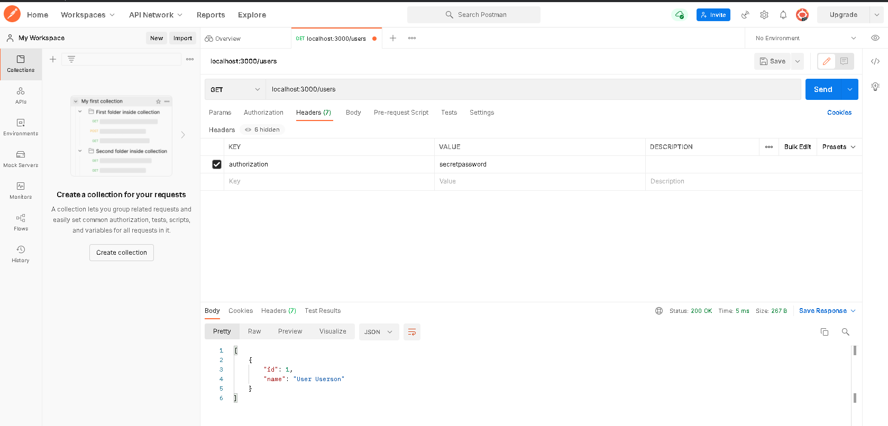
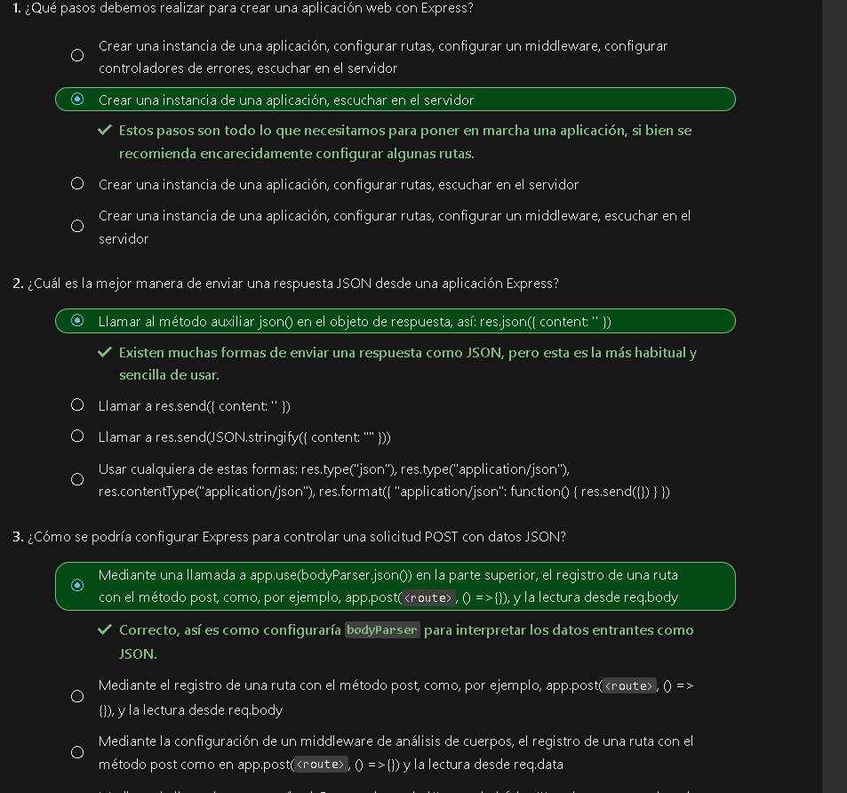

### Que és el package.json?
És donde se guardan las dependencias descargadas al iniciar el proyecto Node.js.
El npm-init és el comando que crea el archivo, predeterminado para el proyecto Node.js.
### Que és el package-lock.json?
És un fichero que contiene información acerca de tu proyecto (nombre, versión, etc) además de listar los paquetes de los que depende.
### Que és el node_modules? Y como funciona?
És un directorio que se crea en la carpeta raíz de nuestro proyecto cuando instalamos paquetes o dependencias mediante npm. De esta forma, desde nuestro código Javascript podemos importar paquetes externos instalados mediante npm, teniéndolos en nuestro proyecto local y sin necesidad de manipularlos manualmente.

Básicamente, cualquier paquete instalado, se almacena dentro de la carpeta node_modules del proyecto, en una carpeta con el nombre del paquete, junto a todos sus ficheros necesarios y dependencias respectivas en su propio node_modules, y así sucesivamente.

### Que són els 'parametres req, res i next'?
**req**: este parámetro es la solicitud entrante. Contiene los encabezados de solicitud y la dirección URL de llamada. Es posible que también tenga un cuerpo de datos si el cliente ha enviado datos con su solicitud.
**res**: este parámetro es una secuencia de respuesta. Use esta secuencia para escribir información como encabezados y datos que quiera devolver al cliente que realiza la llamada.
**next**: este parámetro indica que la solicitud es correcta y que está listo para procesarla. Si no se llama a next(), se detiene el procesamiento de la solicitud. Además, es una buena práctica indicar al cliente por qué no se procesa la solicitud, por ejemplo, llame a res.send('<especifique un motivo por el que se detiene la solicitud>').

Pruebas:

